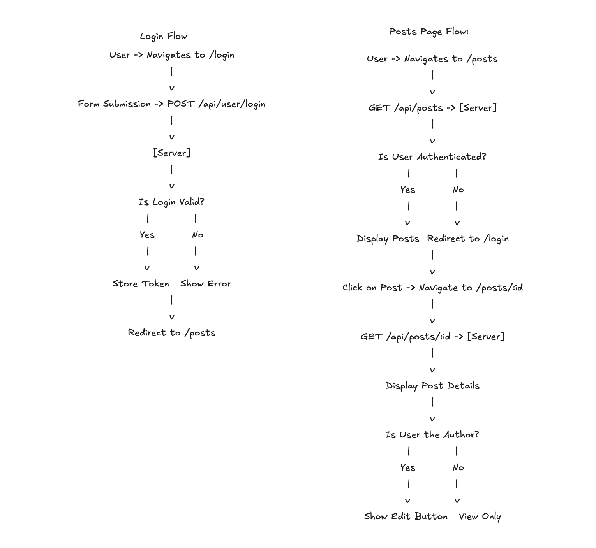

# 📸 PhotoShare Full-Stack Application

## 📝 Overview
**PhotoShare** is a full-stack web application that allows photographers to upload, share, and edit posts with descriptions and images. The project is built with a React frontend and a Node.js/Express backend.

## 📊 Flow Diagram
Below is the flow diagram for the application:

---

## 🛠️ Technologies Used
- **Frontend**: React, Vite, Mantine UI, Zustand for state management
- **Backend**: Node.js, Express, Axios
- **Authentication**: JSON Web Token (JWT)
- **Database**: Fake in-memory database for simplicity

---

## 🚀 Getting Started

### ⚙️ Frontend
- cd frontend
- npm install
- npm run dev

### ⚙️ Backend
- cd backend
- npm start

---

## 🔐 API Endpoints
### 🛡️ Authentication
- POST /api/user/login: Logs in a user and returns a token.
- POST /api/user/validation: Validates a user token.

---

### 📋 Posts
- GET /api/posts: Retrieves all posts.
- GET /api/posts/:id: Retrieves details of a specific post.
- POST /api/posts: Creates a new post.
- PUT /api/posts/:id: Updates an existing post.

